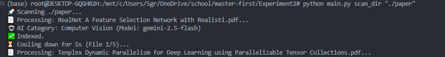
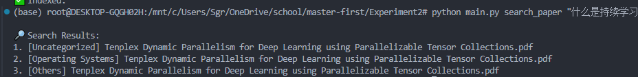
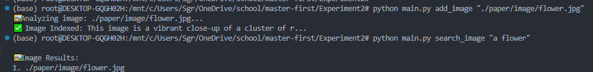

# 🚀 本地 AI 多模态助手 (Local Multimodal AI Agent)

本项目是一个基于 **Python 3.8+** 的本地多模态 AI 助手，利用 **Google Gemini 2.5** 模型和 **ChromaDB** 向量数据库，实现对本地文献与图像的“语义级”管理。

## 🌟 核心功能

*   **📄 智能文献管理**:
    *   **自动归档**: AI 自动阅读 PDF 标题与摘要，根据内容将其分类至相应文件夹（如 NLP, CV, 操作系统等）。
    *   **批量整理**: 支持 `scan_dir` 一键扫描并自动整理整个混乱的论文目录。
    *   **语义搜索**: 支持自然语言提问（如“Transformer 的注意力机制是什么？”），直接定位相关论文。
*   **🖼️ 智能图像管理**:
    *   **以文搜图**: 利用 Gemini Vision 技术生成图片详尽描述，支持通过“海边的日落”等描述词检索本地图库。
*   **🛡️ 鲁棒性设计**: 针对免费版 API 的 **429 (频率超限)** 错误内置了自动等待重试机制，并解决了新版 SDK 的 **404 路径报错**问题。

## 🛠️ 技术栈

*   **大模型 SDK**: `google-genai`
*   **推理模型**: `gemini-2.5-flash` (推荐用于分类，额度稳定)
*   **向量数据库**: `ChromaDB` (轻量化本地向量存储)
*   **多模态处理**: `Pillow` (图像), `pypdf` (文档处理)

## 📦 环境安装

1.  **安装依赖库**:
    ```bash
    pip install google-genai chromadb pypdf Pillow
    ```
2.  **获取 API Key**:
    前往 [Google AI Studio](https://aistudio.google.com/) 获取你的 API Key。

3.  **配置文件**:
    在 `main.py` 中填入你的 `GOOGLE_API_KEY`。

## 📂 项目结构
```text
.
├── main.py             # 统一入口文件
├── requirements.txt    # 依赖清单
├── db/                 # 自动生成的本地向量数据库
├── paper/              # 自动生成的分类归档文件夹
│   ├── NLP/
│   ├── Computer Vision/
│   └── Others/
└── README.md
```

## 🚀 快速开始 (使用说明)

项目根目录下必须包含 `main.py`。

### 1. 文献管理

**添加并分类单篇论文：**
```bash
# 使用内置默认分类
python main.py add_paper "./path/paper.pdf"

# 使用自定义分类
python main.py add_paper "./path/paper.pdf" --topics "CV,NLP,AGI"
```

**一键整理混乱的文件夹：**
```bash
python main.py scan_dir "./your_mess_paper_folder"
```

**语义搜索论文：**
```bash
python main.py search_paper "什么是持续学习？"
```

### 2. 图像管理

**索引图片：**
```bash
python main.py add_image "./path/flower.jpg"
```

**以文搜图：**
```bash
python main.py search_image "一朵花"
```

## 3. 演示与截图 (Demo)
<video controls src="./resource/redpandacompress_demo.mp4" title="Title"></video>

1.  **自动分类演示**:

2.  **语义搜索演示**:

3.  **以文搜图演示**:


## 设计思路说明 (Design Philosophy)
*   **Convention over Configuration (约定优于配置)**: 代码内置了通用的 CS 领域分类列表。用户在大多数情况下无需输入繁琐的参数即可直接使用，仅在需要跨领域整理时才需指定 `--topics`。
*   **Image Captioning Pipeline**: 鉴于纯 API 环境下难以直接获取对齐的图像-文本向量（如 CLIP 原始向量），本项目创新性地使用了“生成式理解”方案。通过 Gemini Vision 将图像“翻译”为详尽的文本描述，再复用高效的文本搜索链路。这既规避了本地部署大模型的硬件门槛，又保证了极高的搜索准确率。


## ⚠️ 常见问题排查 (Troubleshooting)
### 1. 遇到 `429 RESOURCE_EXHAUSTED`?
*   **原因**: 免费 API 频率受限（每分钟请求数有限）。
*   **解决**: 程序已内置 `time.sleep(10)` 和自动重试逻辑。如果依然报错，请增加 `scan_dir` 中的等待时间。

### 2. 遇到 `404 NOT_FOUND`?
*   **原因**: 旧版 SDK 使用 `models/gemini-1.5-flash` 路径，新版 SDK 直接使用 `gemini-1.5-flash`。
*   **解决**: 本项目已将模型引用统一修改为新版规范，请确保 `google-genai` 包已更新。

### 3. 分类结果全是 `Uncategorized`?
*   **原因**: 可能是扫描版 PDF（图片格式）无法提取文字。
*   **解决**: 确保 PDF 是可编辑/可搜索的文本版本。


